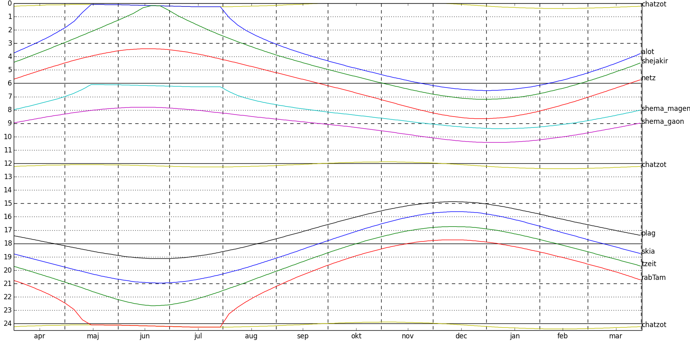

<!--"motivation":" -->
The Machsike Hadas synagogue in Copenhagen has a hard copy table of [halachic times](https://en.wikipedia.org/wiki/Zmanim) relevant to the (geographic) location.
I wanted to visualize them, so I took pictures of it, sent them through an online OCR service, did some manual cleanup of the result, and ended up with CSV files containing data points that, when plotted, yield the curves shown here:

  
<mark>(Click the image to enlarge)</mark>

For the uninitiated, the curve labelled "netz" translates to sunrise, and "skia" is sunset — please note that all data points are in [CET aka. UTC+1](https://www.timeanddate.com/time/zones/cet) ("vintertid" in Danish), i.e. without daylight savings.

For more **details**, see the contents [here (GitHub)](https://github.com/tuejoshua/tuejoshua.github.io/tree/main/zmanim); 
the Py(thon) script which generates this figure from the CSV files is also available as [a GitHub Gist](https://gist.github.com/tuejoshua/a450b4492218327cb46c471e9191adfd)  
...as noted in the disclaimer at the top of the Python code, this was my first attempt at an actual (mini-)project in Python, so the code is quite hacky and not very pleasing to read 🫣